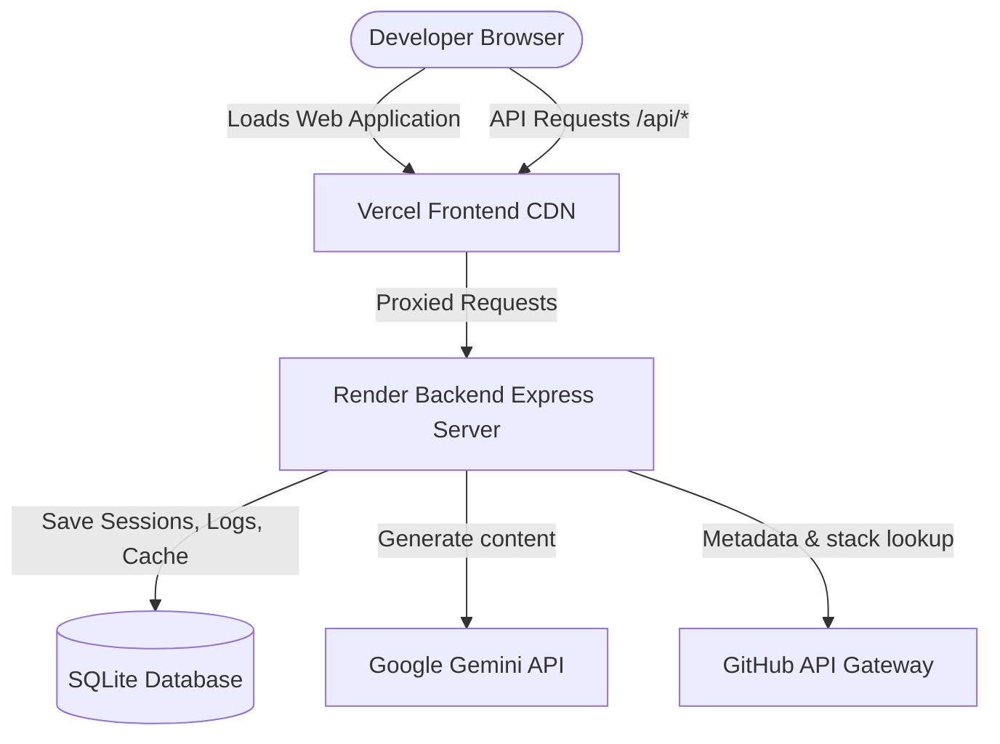

# 🏗️ README Forge Architecture Reference

## Overview
README Forge is a production-grade SaaS platform that enables developers to build custom, visually rich GitHub profile READMEs and automated project documentation.

## System Components

### 1. Frontend Client (React 18 + Vite)
- **Framework**: React 18 using functional components, customized hooks (`useGenerator`, `useAuth`, `useProjects`), Tailwind CSS v3 for styling, and Framer Motion for animations.
- **Routing**: `react-router-dom` v7 handling lazy routing for fast code splits.
- **State Management**: Context-based state containment (`GeneratorContext` and `AuthContext`).

### 2. Backend Gateway (Node.js + Express)
- **AI Gateway**: Implements Prompt Optimization, SHA-256 caching, Request Queuing (deduplication), and fallback routing.
- **Authentication**: GitHub OAuth callback client utilizing secure HttpOnly cookies with state tokens to prevent CSRF attacks.
- **Database**: SQLite (managed through `better-sqlite3` driver) for local user profiles, saved projects, and token/usage logs.

### 3. AI Pipeline & Caching
1. Requests hit `/api/generate` or `/api/generate/project`.
2. Payloads are checked against `better-sqlite3` table `repositoryCache` by generating a SHA-256 hash. If hit, the cache response is returned.
3. If missed, the prompt optimizer strips trailing spaces, compiles templates, and routes the request through a Model Fallback Chain: `gemini-2.5-flash-lite` -> `gemini-2.5-flash` -> `gemini-3.5-flash`.
