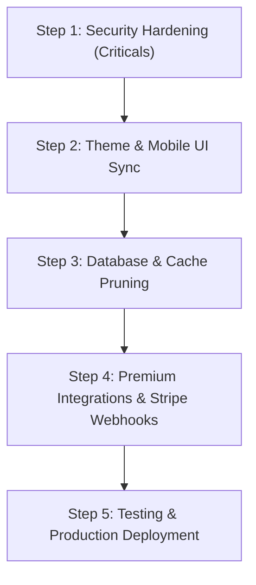

# 🕵️ README Forge: Comprehensive Production Readiness Audit

This document compiles the exhaustive audit findings across the React frontend and the Express backend. It classifies issues by severity, details the exact files and lines affected, outlines recommended next features, and provides a step-by-step launch roadmap.

---

## 📊 Audit Executive Summary

Our deep-dive audit analyzed all frontend and backend source files, database schemas, and configurations. We discovered **73 distinct items** of interest, categorized below:

| Severity | Frontend (UI/UX) Count | Backend (Infra) Count | Key Focus Areas |
| :--- | :---: | :---: | :--- |
| 🔴 **CRITICAL** | 6 | 4 | XSS Vulnerabilities, Auth Bypass, Exposed Secrets, Hook Violations |
| 🟠 **HIGH** | 12 | 7 | Theme Bugs, Anonymous AI Abuse, Unawaited Promises, Session Cookie Leakage |
| 🟡 **MEDIUM** | 15 | 9 | Lack of Mobile Navigation, Monolithic Files, Memory Leaks, No Pagination |
| 🔵 **LOW** | 10 | 10 | Tailwind Style Typos, Unused Dependencies, Console Bloat |
| **TOTAL** | **43** | **30** | **73 Total Findings** |

---

## 🔴 CRITICAL SEVERITY (Must Fix Prior to Launch)

### 1. Exposed Secrets in Git History
* **File:** [`server/.env`](file:///D:/CODE/github_readme_builder/server/.env) (Lines 8-9, 16, 19, 22-26)
* **Description:** API keys (`GEMINI_API_KEY`, `SUPABASE_SERVICE_ROLE_KEY`, `GITHUB_CLIENT_SECRET`, and `JWT_SECRET`) are committed directly to version control. If this repository is public or has been pushed to GitHub, these keys are permanently compromised in the Git history.
* **Fix:** Rotate all credentials immediately. Verify your git history to make sure `.env` was never committed using `git filter-repo` or `BFG Repo-Cleaner` if it was. Ensure `.env` is firmly ignored.

### 2. Broken Authentication Middleware (Auth Bypass Risk)
* **File:** [`server/middleware/requireAuth.js`](file:///D:/CODE/github_readme_builder/server/middleware/requireAuth.js) (Lines 7-21)
* **Description:** `sessionManager.getSession(req)` is asynchronous, but it is called **without** `await`. Consequently, `session` is always a resolved Promise object (which is truthy), and authentication checks pass automatically.
* **Fix:** Convert the middleware function to `async` and add `await`:
  ```javascript
  const session = await sessionManager.getSession(req);
  ```
  *(Note: This file is a duplicate of `middleware/auth.js`. If unused, it should be deleted.)*

### 3. Duplicate & Stubbed Auth Providers
* **Files:** [`src/app/providers/AuthProvider.jsx`](file:///D:/CODE/github_readme_builder/src/app/providers/AuthProvider.jsx) vs [`src/features/auth/AuthProvider.jsx`](file:///D:/CODE/github_readme_builder/src/features/auth/AuthProvider.jsx)
* **Description:** Two `AuthProvider` files exist. The one in `src/app/providers/` is a stub with `isAuthenticated` hardcoded to `true` (L17). If this stub is accidentally imported, login validation will be completely bypassed on the client.
* **Fix:** Delete the duplicate stub in `src/app/providers/` and ensure all imports route through `src/features/auth/AuthProvider.jsx`.

### 4. Cross-Site Scripting (XSS) Vulnerability in Markdown Rendering
* **Files:** [`src/components/common/MarkdownRenderer.jsx`](file:///D:/CODE/github_readme_builder/src/components/common/MarkdownRenderer.jsx) (Line 166) & [`src/utils/markdown.js`](file:///D:/CODE/github_readme_builder/src/utils/markdown.js)
* **Description:** User-supplied markdown strings are rendered in the browser using `dangerouslySetInnerHTML={{ __html: html }}` without sanitization. If an attacker injects custom tags or event handlers, it can execute arbitrary JavaScript in the user's session context.
* **Fix:** Install `dompurify` (or `isomorphic-dompurify`) and sanitize all output before injecting it into the DOM:
  ```javascript
  import DOMPurify from 'dompurify';
  const cleanHtml = DOMPurify.sanitize(rawHtml);
  ```

### 5. Race Condition in Credit Deductions (Concurrency Exploit)
* **File:** [`server/models/User.js`](file:///D:/CODE/github_readme_builder/server/models/User.js) (Lines 127-154)
* **Description:** Credit deductions are performed via a two-step Read-then-Write operation in Node.js. If a user fires multiple rapid requests, both read the current credits value concurrently, resulting in double-spend exploits (generating multiple items for the cost of 1 credit).
* **Fix:** Move credit deductions to an atomic PostgreSQL transaction/trigger or run it as a raw atomic update statement:
  ```sql
  UPDATE users SET credits = GREATEST(0, credits - 1) WHERE id = $1 AND plan != 'premium';
  ```

### 6. ReferenceError in Guided Chat (Review Mode)
* **File:** [`src/components/conversation/ConversationLayout.jsx`](file:///D:/CODE/github_readme_builder/src/components/conversation/ConversationLayout.jsx) (Line 261)
* **Description:** The function call `submitAnswer(formData[id], ...)` attempts to read from a non-existent variable `formData` in the local scope, causing a runtime crash when a user tries to jump back to edit.
* **Fix:** Replace `formData` with `answers` or the actual state object storing the conversational wizard response.

### 7. Rules of Hooks Violations (Early Return / Conditional Hooks)
* **Files:** [`src/app/routes/pages/ProjectBuilder.jsx`](file:///D:/CODE/github_readme_builder/src/app/routes/pages/ProjectBuilder.jsx) (Lines 46-48) & [`src/components/conversation/conversationStore.js`](file:///D:/CODE/github_readme_builder/src/components/conversation/conversationStore.js) (Lines 12-17)
* **Description:** Early returns are placed *before* standard hook initializations, and hooks are declared conditionally inside try/catch blocks. This changes the execution order of React hooks between renders and leads to runtime state mismatch.
* **Fix:** Place all hooks at the very top level of the component/store scope.

---

## 🟠 HIGH SEVERITY (Major UI/UX & Functional Issues)

### 1. Anonymous Users Access Uncapped AI Generations
* **Files:** [`server/routes/generate.js`](file:///D:/CODE/github_readme_builder/server/routes/generate.js) & [`server/routes/generateProject.js`](file:///D:/CODE/github_readme_builder/server/routes/generateProject.js)
* **Description:** Both routes accept requests from unauthenticated guests (`optionalAuth`). Guest users bypass credit checks entirely, which exposes the system to uncapped token usage abuse.
* **Fix:** Enforce authentication using `authMiddleware` for all generation endpoints, or restrict anonymous users to a strict IP-based daily rate limit.

### 2. Jarring Page Themes (Ignoring User Dark/Light Choice)
* **Files:** [`src/app/routes/pages/Settings.jsx`](file:///D:/CODE/github_readme_builder/src/app/routes/pages/Settings.jsx) (Line 37) & [`src/app/routes/pages/NotFound.jsx`](file:///D:/CODE/github_readme_builder/src/app/routes/pages/NotFound.jsx) (Line 30)
* **Description:** These layouts use hardcoded dark theme CSS (`bg-[#0D1117] text-[#F3F4F6]`) regardless of the user's theme selection. In Light Mode, transitioning to these pages displays a jarring shift.
* **Fix:** Refactor background and text color declarations using the responsive theme tokens `{vc.bg}` and `{vc.text}`.

### 3. Missing Mobile Sidebars on Key Dashboards
* **Files:** [`Dashboard.jsx`](file:///D:/CODE/github_readme_builder/src/app/routes/pages/Dashboard.jsx) (Line 95) & [`Projects.jsx`](file:///D:/CODE/github_readme_builder/src/app/routes/pages/Projects.jsx)
* **Description:** The sidebar on the user dashboard uses Tailwind's `hidden md:flex`, meaning it disappears completely on screens smaller than 768px. Mobile users have no hamburger menu, no navbar, and no way to navigate out of the dashboard.
* **Fix:** Implement a collapsible drawer or hamburger toggle wrapper for smaller displays.

### 4. Cross-Origin Cookie Support Failures
* **File:** [`server/sessionManager.js`](file:///D:/CODE/github_readme_builder/server/sessionManager.js) (Lines 44-48)
* **Description:** The session cookie is issued with `SameSite=Lax`. When the backend runs on Render and the frontend runs on Vercel (different domains), browsers block Lax cookies on cross-origin requests.
* **Fix:** Set `SameSite=None; Secure` on the session cookie if the client and server are deployed on different domains, or set up a domain-level proxy (e.g., matching root domains).

### 5. Fire-and-Forget Database Promises (Uncaught Rejections)
* **Files:** [`server/routes/generate.js`](file:///D:/CODE/github_readme_builder/server/routes/generate.js) (Line 169) & [`server/routes/generateProject.js`](file:///D:/CODE/github_readme_builder/server/routes/generateProject.js) (Lines 191, 195)
* **Description:** `trackUsage` and `setPersistentCache` promises are called without an `await` statement. If these queries fail, they trigger uncaught background promise rejections, which crashes the Node.js application process in newer runtime versions.
* **Fix:** Prepend `await` to all asynchronous database calls, or append `.catch(err => ...)` to handle failure scenarios gracefully.

---

## 🟡 MEDIUM SEVERITY (Polish & Optimization)

1. **Monolithic Components:** [`HomePortal.jsx`](file:///D:/CODE/github_readme_builder/src/app/routes/pages/HomePortal.jsx) is a 722-line monolith. It should be decomposed into modular components (Hero, Features, Pricing, FAQs, Footer) to improve legibility.
2. **Missing `React.memo`:** Wizard step components and pure inputs (`InputField`, `SelectField`) are re-evaluated on every character keystroke because they lack memoization.
3. **No Database Pruning:** The backend contains a persistent repository cache and user sessions, but does not run cleanups. Inactive session logs will build up indefinitely.
4. **Tailwind Class Inconsistencies:** The code uses classes like `z-35`, `gray-905`, and `gray-655` which are not defined in the default Tailwind palette or custom theme mappings, causing them to render as no-op styles.
5. **No Form Validations:** Repositories can be requested with malformed URL structures without any frontend client checks.

---

## 🚀 Recommended Production Roadmap (Next Steps)



### Phase 1: Security Hardening (Immediate)
- Delete dead components like `EditorPage.jsx`, `services/auth.js`, and `requireAuth.js`.
- Clean the committed environment files from history and update backend models to use Database UUID generation.
- Integrate `dompurify` sanitizer in `MarkdownRenderer.jsx` to prevent markup injection.

### Phase 2: User Interface & Theme Standardization
- Swap hardcoded colors on `Settings`, `NotFound`, and Loading views for variables.
- Wrap mobile views with responsive hamburger layout selectors.
- Connect settings inputs to the database `user_settings` schema.

### Phase 3: SaaS Features (Next Actions)
1. **Periodic Credits Reset:** Implement a database cron routine to restore credit balances of `free` plan tiers to 20 tokens at the start of each month.
2. **Stripe Billing Integration:** Create an endpoint to handle billing webhook callbacks to upgrade user accounts to `premium` plan states.
3. **Admin Panel Interface:** Create simple views to audit cost generation statistics, active API queries, and overall model performance.
